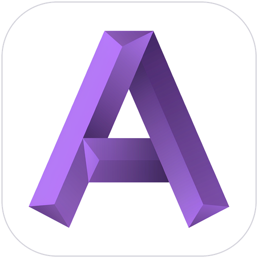

<div align="center">



# aglab

**一个跑在你桌面上的 AI 编程助手（Windows）**

接入你自己的模型服务商，让模型在指定工作目录里安全地读代码、跑命令、改文件——写代码之外，还能生图、生视频、做音乐。

[](./LICENSE)
[](#-许可证--license)
[](https://github.com/Technicalflight/aglab/actions/workflows/ci.yml)


🌐 [在线官网](https://technicalflight.github.io/aglab-site/) · [下载安装包](https://github.com/Technicalflight/aglab/releases) · [社区](https://linux.do)

</div>

## ✨ 简介

aglab 是一个 Windows 桌面端的 AI 编程助手：模型从你来定（任何 OpenAI 兼容协议的服务商，多档案 + 模型池路由），活儿在你的工作目录里干——读代码、执行命令、改文件，每一步都有规则库、审批与审计兜底。

它不只是一个聊天窗口：对话、生图、视频、音乐是四类各自独立的能力会话；模型看不懂的东西可以喂给它看（图片/视频/音频多模态识别）；长对话自动压缩，关键结论沉淀进记忆与知识库。

## 🎯 功能特性

| 模块 | 说明 |
|------|------|
| 💬 对话 | 多服务商档案与模型池路由、上下文缓存保温、对话分支树、全文搜索、自动压缩 |
| 🧰 工具系统 | 读写/命令/网络等内置工具；逐调用沙箱收容、规则库 + 审批（单次放行/总是允许）、审计中心与敏感打码、删除进回收站 + 自动备份 |
| 🖼️🎵 能力会话 | 生图（图生图与参数面板）、视频（文/图/视频转视频与首尾帧）、音乐（多家族 API 自动探测、歌词模式）、语音合成与转写 |
| 👁️ 多模态识别 | 图片/视频/音频本体随行发给支持的模型，看图听音按模型能力逐个放行 |
| 🤖 MCP | stdio 与 HTTP 服务器、OAuth 授权、工具总开关 |
| 🎯 目标模式 | 给一个目标，模型带着判据清单自主推进，含强制修复轮 |
| ⏰ 定时任务 | 每周计划与 cron 表达式触发，跑完系统通知 |
| 🧠 记忆与知识库 | 会话记忆自动蒸馏；本地知识库检索 |
| 🔌 扩展 | 技能（Skills）、SSH 主机、LSP、浏览器控制（CDP）、PTC code-mode |

## 🚀 使用

到 [Releases](https://github.com/Technicalflight/aglab/releases) 下载安装包（NSIS `.exe` 或 `.msi`）安装。安装包当前未做代码签名，SmartScreen 提示时选「更多信息 → 仍要运行」。

首次启动三步：在设置里填服务商（Base URL + API Key，OpenAI 兼容协议）→ 选工作目录 → 开聊。

> 当前以 Windows 10/11 为主，未在其他平台验证。

## 🛠️ 开发

前置要求：Node.js 22+、Rust stable（MSVC 工具链）、Windows 10/11。

```bash
npm install            # 安装前端依赖
npm run tauri dev      # 本地开发（前端热更新 + Rust 增量编译）

npm test               # 前端测试（vitest）
cd src-tauri && cargo test   # 后端测试（1100+ 条）

npm run tauri build    # 产出 NSIS / MSI 安装包
```

推送与 PR 会自动触发 CI（前端 + Windows 双管道，见 `.github/workflows/ci.yml`）；打 `v*` 标签自动构建安装包并挂到 Release。

**发布带自动更新的版本**：安装包必须带 minisign 签名（应用内更新器的公钥在 `src-tauri/tauri.conf.json` 的 `plugins.updater`）。本机构建时设置：

```bash
TAURI_SIGNING_PRIVATE_KEY="C:\Users\<你>\.tauri\aglab-updater.key" \
TAURI_SIGNING_PRIVATE_KEY_PASSWORD="" \
npm run tauri build
```

私钥文件**绝不入库**；发布时把安装包与 `.sig` 传到官网仓库（`dl/`），并更新 `updater/latest.json`（版本、说明、签名与下载地址）——应用内更新器读的就是这份清单。CI 打包从仓库 Secret `TAURI_SIGNING_PRIVATE_KEY` 取同一把私钥。

## 📁 文件结构

```
aglab/
├── src/                  React 19 + TypeScript 前端（Vite）
├── src-tauri/            Rust 后端（Tauri 2）：会话/工具/生成管线/存储
├── .github/workflows/    CI / 发布 / 安全审计工作流
└── assets/               README 配图
```

## 📄 许可证 / License

本项目基于 [GNU Affero General Public License v3.0（AGPL-3.0）](./LICENSE) 协议开源。

- 你可以自由地使用、学习、修改和分发本项目，但须完整遵循 AGPL-3.0 的全部条款，包括通过**网络提供服务**时也须向使用者开放源代码的义务；
- **⚠️ 商用需授权：任何商业用途**（包括但不限于将本项目或其衍生作品集成到商业产品、商业服务、SaaS、付费工具中，或基于其开展商业经营活动）**必须事先获得作者书面授权**；
- 如需商业授权，请通过 [社区](#-社区联系--community) 或提交 Issue 联系作者洽谈。

## 💬 社区联系 / Community

- **[Linux.Do](https://linux.do)** — 一个分享和讨论技术的社区

## ☕ 赞助 / Sponsor

如果对你有帮助，欢迎请作者喝杯咖啡或可乐 ☕🥤——每一杯都是持续开发的动力。

<p align="center">

&nbsp;&nbsp;&nbsp;&nbsp;&nbsp;&nbsp;

</p>

<p align="center"><sub>左：支付宝 Alipay &nbsp;·&nbsp; 右：微信 WeChat Pay</sub></p>

> [!WARNING]
> **赞助前请务必阅读**：赞助是**完全自愿**的感谢行为。**赞助不会提高或加快任何功能、缺陷修复或其他工作的实现优先级**——所有开发与是否赞助、赞助多少完全无关。赞助仅代表感谢，不构成任何商业授权、优先支持或其他额外承诺。
